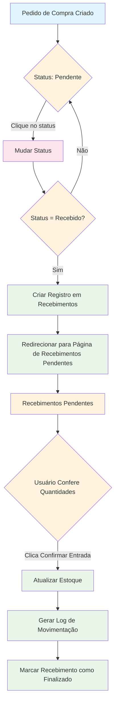

# Fluxograma do Processo de Compras e Recebimentos

## Descrição Detalhada do Fluxo

### 1. Pedido de Compra Criado
- Um novo pedido de compra é criado com status inicial "Pendente"

### 2. Status: Pendente
- O pedido permanece com status "Pendente" até que seja processado

### 3. Mudar Status (Interação do Usuário)
- O usuário pode clicar diretamente no status para alterá-lo
- Interface intuitiva para mudança de status

### 4. Verificação de Status
- Sistema verifica se o novo status é "Recebido"

### 5. Criar Registro em Recebimentos
- Quando status muda para "Recebido":
  - Sistema cria automaticamente um registro na página de recebimentos
  - Produto ainda não entra no estoque
  - Aparece na página "Recebimentos Pendentes"

### 6. Redirecionar para Página de Recebimentos Pendentes
- Após criar o registro, o sistema redireciona automaticamente para a página de recebimentos pendentes

### 7. Recebimentos Pendentes
- Lista de todos os recebimentos que ainda não foram confirmados
- Mostra detalhes dos produtos e quantidades esperadas

### 8. Usuário Confere Quantidades
- Usuário verifica fisicamente as quantidades recebidas
- Interface permite ajustes se necessário

### 9. Confirmar Entrada (Ação do Usuário)
- Usuário clica no botão "Confirmar Entrada" após conferência

### 10. Atualizar Estoque
- Sistema adiciona automaticamente as quantidades conferidas ao estoque

### 11. Gerar Log de Movimentação
- Sistema registra a movimentação no log de estoque para rastreabilidade

### 12. Marcar Recebimento como Finalizado
- Status do recebimento é atualizado para "Finalizado"
- Processo completo

## Regras de Negócio

1. **Mudança de Status**: Apenas usuários autorizados podem mudar o status dos pedidos
2. **Redirecionamento Automático**: Sempre que um pedido muda para "Recebido", o sistema redireciona automaticamente
3. **Conferência Obrigatória**: Não é possível finalizar um recebimento sem a conferência do usuário
4. **Atualização de Estoque**: O estoque só é atualizado após a confirmação do recebimento
5. **Rastreabilidade**: Todas as movimentações são registradas no log

## Estados Possíveis

### Pedido de Compra
- **Pendente**: Pedido criado mas não processado
- **Pedido**: Pedido enviado ao fornecedor
- **Parcialmente Recebido**: Parte dos itens já foi recebida
- **Recebido**: Todos os itens foram recebidos (gera registro em recebimentos)
- **Cancelado**: Pedido cancelado

### Recebimento
- **Pendente**: Aguardando conferência do usuário
- **Finalizado**: Recebimento confirmado e estoque atualizado