# Fluxo Técnico de Compras e Recebimentos

## Diagrama de Componentes e Fluxo de Dados

```mermaid
graph LR
    A[PurchaseOrderList] --> B[PurchaseOrderForm]
    B --> C{onChangeStatus}
    C --> D[Atualizar Status Pedido]
    D --> E{Status = Recebido?}
    E -->|Sim| F[Criar GoodsReceipt]
    E -->|Não| G[Voltar para Listagem]
    F --> H[Redirecionar para GoodsReceipts]
    H --> I[GoodsReceiptList]
    I --> J[GoodsReceiptForm]
    J --> K{onClick Confirmar}
    K --> L[Atualizar Estoque]
    L --> M[Gerar Log Movimentação]
    M --> N[Atualizar Status Recebimento]
    
    style A fill:#e3f2fd
    style B fill:#e8f5e8
    style C fill:#fff3e0
    style D fill:#fce4ec
    style E fill:#fff3e0
    style F fill:#e8f5e8
    style G fill:#ffebee
    style H fill:#e1f5fe
    style I fill:#e3f2fd
    style J fill:#e8f5e8
    style K fill:#fff3e0
    style L fill:#e8f5e8
    style M fill:#e8f5e8
    style N fill:#e8f5e8
```



## Implementação Técnica

### 1. Componente PurchaseOrderList
Responsável por listar os pedidos de compra e permitir a mudança de status através de clique direto.

```typescript
// Função para lidar com mudança de status
const handleStatusChange = async (orderId: number, newStatus: string) => {
  try {
    // Atualizar status no banco de dados
    await updatePurchaseOrderStatus(orderId, newStatus);
    
    // Se status for "Recebido", criar registro em recebimentos
    if (newStatus === 'received') {
      await createGoodsReceiptFromOrder(orderId);
      // Redirecionar para página de recebimentos
      navigate('/goods-receipts');
    }
    
    // Atualizar lista
    refreshOrders();
  } catch (error) {
    toast.error('Erro ao atualizar status do pedido');
  }
};
```

### 2. Componente PurchaseOrderForm
Formulário de edição de pedidos de compra com funcionalidade de mudança de status.

```typescript
// Função para mudança de status via clique
const toggleStatus = () => {
  const nextStatus = getNextStatus(currentStatus);
  handleStatusChange(orderId, nextStatus);
};
```

### 3. Serviço de Criação Automática de Recebimentos

```typescript
// Função para criar recebimento automaticamente
const createGoodsReceiptFromOrder = async (orderId: number) => {
  try {
    const order = await getPurchaseOrder(orderId);
    
    const goodsReceiptData = {
      purchase_order_id: orderId,
      receipt_date: new Date().toISOString(),
      received_by: currentUser.name,
      status: 'pending', // Status inicial do recebimento
      items: order.items.map(item => ({
        product_id: item.product_id,
        quantity: item.quantity,
        unit_price: item.unit_price,
        total: item.total
      }))
    };
    
    return await createGoodsReceipt(goodsReceiptData);
  } catch (error) {
    throw new Error('Falha ao criar recebimento automático');
  }
};
```

### 4. Componente GoodsReceiptList
Lista de recebimentos pendentes para conferência.

```typescript
// Carregar apenas recebimentos pendentes
useEffect(() => {
  loadPendingReceipts();
}, []);

const loadPendingReceipts = async () => {
  try {
    const pendingReceipts = await getGoodsReceiptsByStatus('pending');
    setReceipts(pendingReceipts);
  } catch (error) {
    toast.error('Erro ao carregar recebimentos pendentes');
  }
};
```

### 5. Componente GoodsReceiptForm
Formulário para conferência e confirmação de recebimentos.

```typescript
// Função para confirmar recebimento
const confirmReceipt = async () => {
  try {
    // Validar dados de conferência
    if (!validateQuantities()) {
      toast.error('Verifique as quantidades conferidas');
      return;
    }
    
    // Atualizar estoque
    await updateInventoryFromReceipt(receiptId, confirmedItems);
    
    // Gerar log de movimentação
    await createMovementLog(receiptId, 'entrada', confirmedItems);
    
    // Atualizar status do recebimento para finalizado
    await updateGoodsReceiptStatus(receiptId, 'completed');
    
    toast.success('Recebimento confirmado com sucesso!');
    navigate('/goods-receipts');
  } catch (error) {
    toast.error('Erro ao confirmar recebimento');
  }
};
```

### 6. Serviço de Atualização de Estoque

```typescript
// Função para atualizar estoque após confirmação
const updateInventoryFromReceipt = async (receiptId: number, items: ReceiptItem[]) => {
  try {
    // Para cada item conferido, atualizar quantidade em estoque
    for (const item of items) {
      const product = await getProduct(item.product_id);
      const newQuantity = product.quantity + item.confirmed_quantity;
      
      await updateProductQuantity(item.product_id, newQuantity);
    }
  } catch (error) {
    throw new Error('Falha ao atualizar estoque');
  }
};
```

### 7. Serviço de Log de Movimentação

```typescript
// Função para gerar log de movimentação
const createMovementLog = async (receiptId: number, type: 'entrada' | 'saida', items: ReceiptItem[]) => {
  try {
    for (const item of items) {
      const logEntry = {
        product_id: item.product_id,
        type,
        quantity: item.confirmed_quantity,
        date: new Date().toISOString(),
        reference_id: receiptId,
        user_id: currentUser.id
      };
      
      await createInventoryLog(logEntry);
    }
  } catch (error) {
    throw new Error('Falha ao gerar log de movimentação');
  }
};
```

## Fluxo Completo de Integração

1. **Usuário clica no status do pedido** (PurchaseOrderList/PurchaseOrderForm)
2. **Sistema atualiza o status** no banco de dados
3. **Se status = "Recebido"**:
   - Sistema cria automaticamente um registro em GoodsReceipts
   - Sistema redireciona para a página de recebimentos
4. **Usuário acessa GoodsReceiptList** e vê os recebimentos pendentes
5. **Usuário acessa GoodsReceiptForm** para conferir quantidades
6. **Usuário clica em "Confirmar Entrada"**:
   - Sistema valida as quantidades conferidas
   - Sistema atualiza o estoque dos produtos
   - Sistema gera log de movimentação
   - Sistema atualiza status do recebimento para "Finalizado"

## Tratamento de Erros

- **Falha na atualização de status**: Mostrar mensagem de erro e manter interface funcional
- **Falha na criação automática de recebimento**: Registrar erro e permitir criação manual
- **Falha na atualização de estoque**: Reverter operação e mostrar mensagem de erro
- **Falha no log de movimentação**: Continuar processo mas registrar erro para auditoria

## Segurança e Permissões

- Apenas usuários com permissão podem mudar status de pedidos
- Apenas usuários com permissão podem confirmar recebimentos
- Todas as operações são registradas com usuário responsável
- Validação de dados em frontend e backend